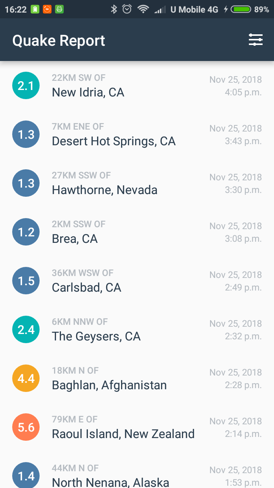
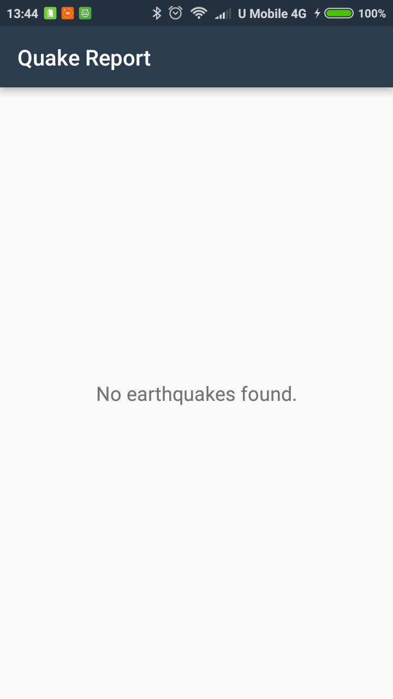
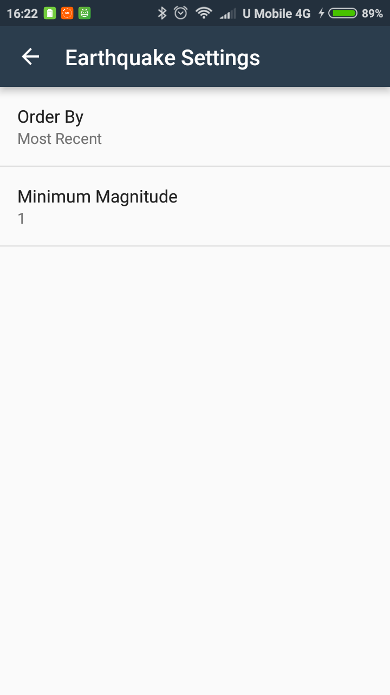
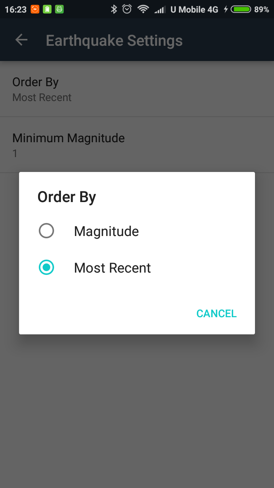

# Quake Report App

  
  
  
  

## Getting Started

This mobile app display a list of recent earthquakes in the world from the U.S. Geological Survey (USGS) organization, which developed during [Udacity's Android Basics: Networking Course](https://www.udacity.com/course/android-basics-networking--ud843).

The earthquake data is retrieved from [USGS service website](https://earthquake.usgs.gov/fdsnws/event/1/).

## Deployment

Tested on Android 6.0 mobile phone.

## Built With

[Android Studio 3.1.3](https://developer.android.com/studio/) 

## Versioning

[Semantic Versioning (SemVer) 2.0.0](http://semver.org/)

## Authors

**Jerry Chong** - [jerrychong25](https://github.com/jerrychong25)

## License

This project base code is originally provided by Udacity's Android Basics: Multiscreen Apps Course Course Leads Chris Lei and Joe Lewis.
